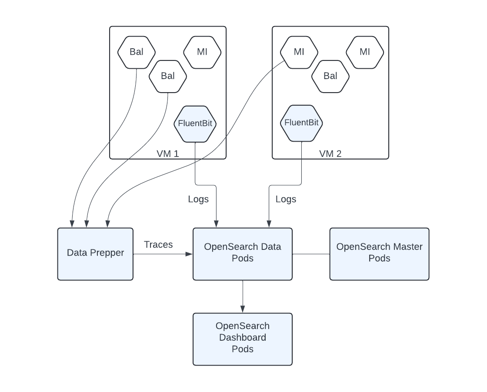

# WSO2 Observability Solution

WSO2 observability solution provides monitoring and analytics capabilities for WSO2 products based on open source products and standards such as OpenSearch, Fluent-Bit, and Open Telemetry.

## Installation

### Prerequisites

This version of the observability solution focuses on Kubernetes-based environments, where WSO2 products and the observability solution are deployed on Kubernetes. Therefore, a Kubernetes cluster and the Helm package management system are required for installing and working with this solution.

- **Kubernetes:**
 For trying out the solution, it is possible to set up a Kubernetes cluster locally using the [Rancher Desktop](https://docs.rancherdesktop.io/getting-started/installation) or the [Docker Desktop](https://www.docker.com/get-started/). Alternatively, any on-premise or cloud-based Kubernetes cluster such as [Azure Kubernetes Service (AKS)](https://azure.microsoft.com/en-us/products/kubernetes-service) or [Amazon Elastic Kubernetes Service (EKS)](https://aws.amazon.com/eks/) can be used.

- **Helm:**
Rancher Desktop has Helm built-in. If not, install [Helm](https://helm.sh/docs/intro/install/)

The following prerequisites are required only for trying out samples.

- **Ballerina:** Install the [Ballerina programming laguage](https://ballerina.io/downloads/).

- **Maven:** [Download](https://maven.apache.org/download.cgi) and [install](https://maven.apache.org/install.html) the Maven build system.

- **Postman:** Download and install the [Postman](https://www.postman.com/downloads/) client for invoking sample APIs. 

### Deploying the observability solution

Once the prerequisites are setup, the observability solution can be deployed by executing the provided installation script.

1. Extract the wso2-observability-resources-m2.zip file to a local folder. Alternatively, clone [this](https://github.com/wso2/observability-resources) repository to a local folder.

2. Navigate to the `<local_folder>/observability-resources/observability/` folder and execute the installation script using the following command.
```
sh deploy-observability.sh
```
3. Access the observability dashboard
    - Port forward 5601, which is used by the observability dashboard.
    ```
    kubectl port-forward svc/opensearch-dashboards 5601:5601 -n observability
    ```
    - Log in to the OpenSearch dashboard at URL [http://localhost:5601](http://localhost:5601) using the default credentials *(username: admin, password: admin)* 
    - Navigate to *Dashboards* menu.  Click on the *Integration logs dashboard* or *Integration metrics dashboard* to view the required dashboard.

## Trying out samples

A set of sample Ballerina, Micro Integrator, and API Manager deployments are included to try out this solution. Depending on the request payload, these samples generate logs, tracing data, and metrics data, which can be visualized in observability dashboards.

>**Note**: [NGINX Ingress Controller](https://kubernetes.github.io/ingress-nginx/deploy/) is required for trying out API Manager samples.

1. Navigate to the `<local_folder>/observability-resources/samples` folder and execute the following command to build and deploy all samples:
```
sh deploy_samples.sh
```

2. Port forward 8290 and 9100, which are used by MI and Ballerina deployments.
```
kubectl port-forward svc/bookpark-svc 8290:8290
kubectl port-forward svc/portal-svc 9100:9100
```

3. Import `<local_folder>/observability-resources/samples/postman/WSO2_Observability.postman_collection.json` to Postman. This contains various requests that cause deployed MI and Ballerina pods to generate logs, tracing data, and metrics data.

Below are the interactions among sample services when invoking Postman requests.

**Ballerina - Place order**\
Multiple Ballerina services are invoked as shown below:


**Ballerina - Place order Inventory error**\
Same as *Ballerina - Place order*, but the inventory service causes an error.

**Ballerina - Place order Shipment error**\
Same as *Ballerina - Place order*, but the shipment service causes an error.

**Ballerina - Place order CRM error**\
Same as *Ballerina - Place order*, but the CRM service causes an error.

**MI - Inspection**\
Invokes the Quality inspection service deployed in MI

**MI - Inspection Error**\
Invokes the Quality inspection service deployed in MI, but causes an error

**MI - Inventory**\
Invokes the Inventory service deployed in MI

**MI - Bookstore**\
Multiple MI and Ballerina services are invoked as shown below:


**Ballerina - Place order Inventory error**\
Same as *MI - Bookstore*, but the shipment service causes an error.

**Bal_MI - Place book order**\
Multiple MI and Ballerina services are invoked as shown below:


4. Access API Manager web portals and invoke pre-deployed APIs

    1. Obtain the external IP (EXTERNAL-IP) of the Ingress resources by listing down the Kubernetes Ingresses.

        ```bash
        kubectl get ing -n <NAMESPACE>
        ```

        Example:

        ```bash
        NAME                                           CLASS   HOSTS                ADDRESS          PORTS     AGE
        wso2-apim-am-all-in-one-am-gateway-ingress     nginx   gw.wso2.com          <EXTERNAL-IP>   80, 443   28h
        wso2-apim-am-all-in-one-am-ingress             nginx   am.wso2.com          <EXTERNAL-IP>   80, 443   28h
        wso2-apim-am-all-in-one-am-websocket-ingress   nginx   websocket.wso2.com   <EXTERNAL-IP>   80, 443   28h
        wso2-apim-am-all-in-one-am-websub-ingress      nginx   websub.wso2.com      <EXTERNAL-IP>   80, 443   28h
        ```

    2. Add the above hosts as entries in `/etc/hosts` file as follows:

        ```
        <EXTERNAL-IP> am.wso2.com
        <EXTERNAL-IP> gw.wso2.com
        <EXTERNAL-IP> websub.wso2.com
        ```

    3. Try navigating to:

        - `https://am.wso2.com/carbon`
        - `https://am.wso2.com/publisher`
        - `https://am.wso2.com/devportal`

        from your favorite browser.


4. In the OpenSearch dashboard, Navigate to `Dashboards -> Integration logs dashboard` to view log analytics of MI and Ballerina deployments. A logs dashboard, similar to the one shown below, will be displayed with details of MI and Ballerina logs.


5. Navigate to `Observability -> Traces` tab to view tracing data of MI and Ballerina service invocations.


6. Navigate to `Dashboards -> Integration metrics dashboard` to view metrics data.


## Architecture

The architecture of the observability solution is shown below.



Fluent Bit pods are deployed as a Kubernetes DaemonSet. Therefore, One Fluent Bit pod will be deployed in each VM in the Kubernetes cluster. These Fluent Bit pods capture logs emitted by all pods in their corresponding VMs and send those to OpenSearch data pods. Before sending logs, Fluent Bit pods perform some preprocessing operations such as extracting required fields, adding metadata fields, and renaming fields.

Each MI and Ballerina pod sends tracing data to Data Prepper according to the Open Telemetry format. Data Prepper performs some preprocessing operations and sends processed tracing data to OpenSearch data pods.

OpenSearch data pods handle all data processing operations such as indexing, searching, and aggregations. OpenSearch master pods perform cluster coordination operations such as index/shard allocations and maintaining the cluster's health. OpenSearch dashboard pods act as the backend for the observability dashboard. All log visualizations and dashboards are deployed into dashboard pods. 

### Deploying the observability solution on VMs

#### Ubuntu

- Clone the observability repository
- Navigate to the `observability-resources/observability/vm` folder.
- Run the `deploy.sh` script by providing the component name to be installed as the first argument.
    - Install OpenSearch: `sudo -E bash deploy.sh opensearch`
    - Install OpenSearch Dashboards: `sudo -E bash deploy.sh opensearch-dashboards`
    - Install Fluent Bit: `sudo -E bash deploy.sh fluentbit` 
    - Install Data Prepper: `sudo -E bash deploy.sh data-prepper`
- It is possible to install all components in a single VM (e.g. for testing or demo purposes) by running the following command: - `sudo -E bash deploy.sh local`

#### Mac

- Install Java
- Install Puppet agent
- Navigate to the `observability-resources/observability/vm` folder.
- Run `sudo -E bash deploy.sh local` to deploy all components of the locally

### Deploying samples

#### Ubuntu

- Clone the observability repository
- Navigate to the `observability-resources/samples/vm` folder.
- Run the follwoing command: `sudo -E bash deploy.sh samples`

#### Mac

- Install Java
- Install Puppet agent
- Clone the observability repository
- Navigate to the `observability-resources/samples/vm` folder.
- Run the follwoing command: `sudo -E bash deploy.sh samples`