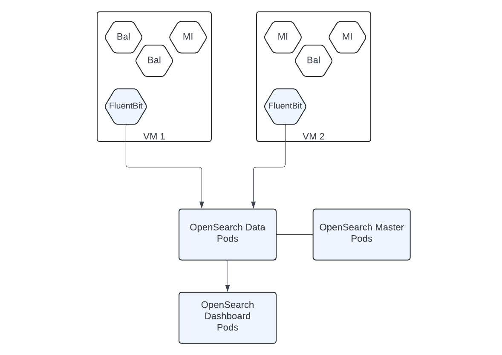

# WSO2 Observability Solution

WSO2 observability solution provides monitoring and analytics capabilities for WSO2 products based on open source products and standards such as OpenSearch, Fluent-Bit, and Open Telemetry.

## Installation

### Pre-requisites

This version of the observability solution focuses on Kubernetes-based environments, where WSO2 products and the observability solution are deployed on Kubernetes. Therefore, a Kubernetes cluster and the Helm package management system is requried for installing and working with this solution.

- **Kubernetes:**
 For trying out the solution, it is possible to setup a Kubernetes cluster locally using the [Rancher Desktop](https://docs.rancherdesktop.io/getting-started/installation) or the [Docker Desktop](https://www.docker.com/get-started/). Alternatively, any on-premise or cloud-based Kubernetes cluster such as [Azure Kubernetes Service (AKS)](https://azure.microsoft.com/en-us/products/kubernetes-service) or [Amazon Elastic Kuberntes Service (EKS)](https://aws.amazon.com/eks/) can be used.

- **Helm:**
Rancher Desktop has Helm built-in. If not, install [Helm](https://helm.sh/docs/intro/install/)

The following pre-requisites are required only for trying out samples.

- **Ballerina:** Install the [Ballerina programming laguage](https://ballerina.io/downloads/).

- **Maven:** [Download](https://maven.apache.org/download.cgi) and [install](https://maven.apache.org/install.html) the Maven build system.

- **Postman:** Download and install the [Postman](https://www.postman.com/downloads/) client for invoking sample APIs. 

### Deploying the observability solution

Once the pre-requisites are setup, the observability solution can be deployed by executing the provided installation script.

1. Clone this repository to a local folder.

2. Naviagte to the `<local_folder>/observability-resources/observability/` folder and execute the installation script using the following command.
```
sh deploy-observability.sh
```
3. Access the observability dashboard 
    - Log in to the OpenSearch dashboard at URL [http://localhost:5601](http://localhost:5601) using the default credentials *(username: admin, password: admin)* 
    - Navigate to *Dashbaords* menu and click on the *Integration logs dashbaord* to view the logging dashboard.

## Trying out samples

A set of sample Ballerina and Micro Integrator deployments are included to try out this solution. Depending on the request payload, these samples generate logs with different log levels, which can be visualized in observability dashboards.

1. Navigate to the `<local_folder>/observability-resources/samples` folder and execute the following command to build and deploy all samples:
```
sh deploy_samples.sh
```

2. Port forward 8290 and 9100, which are used by MI and Ballerina deployments.
```
kubectl port-forward svc/bookpark-svc 8290:8290
kubectl port-forward svc/portal-svc 9100:9100
```

3. Import `<local_folder>/observability-resources/samples/postman/Integration_Observability.postman_collection.json` to Postman. This contains various requests that cause deployed MI and Ballerina pods to emit different log messages.

4. In the OpenSearch dashboard, Navigate to `Dashboards -> Integration logs dashboard` to view log analytics of MI and Ballerina deployments.

## Architecture

The architecture of the observability solution is shown below.



Fluent Bit pods are deployed as a Kubernetes deamon set. Therefore, One Fluent Bit pod will be deployed in each VM in the Kubernetes cluster. These Fluent Bit pods capture logs emitted by all pods in their corresponding VMs and send those to OpenSearch data pods. Before sending logs, Fluent Bit pods perform some preprocessing operations such as extracting required fields, adding metadata fields, and renaming fields.

OpenSearch data pods handle all data processing operations such indexing, searching, and aggregrations. OpenSearch master pods peform cluster coordination operations such as index/shard allocations and maintaining cluster's health. OpenSearch dashboards pods act as the backend for the observability dashboard. All log visualizations and dashboards are deployed into dashboard pods. 